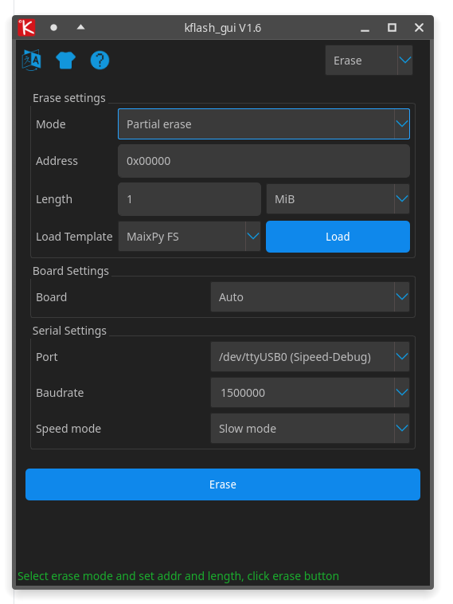
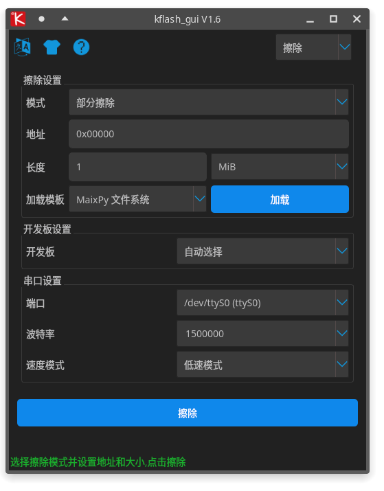

# kflash_gui
=============

Cross platform GUI wrapper for [kflash.py](https://github.com/sipeed/kflash.py.git) (download(/burn) tool for k210)


## Features

* Support `*.bin` and `*.kfpgk` file with file picker
* Support development board select(And auto detect, you should select board manually if you want to use high speed mode)
* Support select where the firmware burned to
* Auto scan serial port support
* Baudrate editable
* White skin and night skin support
* Support Chinese and English Language 
* Download(/burn) progress and speed display
* Cancel download support
* Support merge bins to one bin file(Especially for factory flash burn usage)
* Support convert kfpkg to one bin file
* Support enbale bin file or not
* Auto identify firmware file
* Erase flash support(Full chip or partial erase)

## Screenshots

|  |  |
| -| -|
|  |  |
|  |  |
|  | 

## Usage

* Download bin file (`kflash_gui_v*.*`)  [here](https://github.com/sipeed/kflash_gui/releases)

* Compress and double click `kflash_gui.exe` or `kflash_gui`

* you can create your own shortcut by yourself； If `Linux`， edit the path in `kflash_gui.desktop`, then copy this file to `/usr/share/application` folder with administrator, and finally you can find `kflash_gui` app in the system menu

* Select `bin` file or `kfpkg` file， set address to `0x0000` if file is firmware
* Select board
* Select where firmware flash to, `Flash` or `SRAM`
* Select serial port
* Select baudrate, `1.5M` recommend
* Click Download to burn firmware or model to board

## Running from source

This repository uses submodules. The ``--recursive`` should be used so the required submodule(s) are downloaded.

```bash
git clone  --recursive https://github.com/sipeed/kflash_gui.git
cd kflash_gui
```

Assuming a Debian based distro is being used, dependencies can be installed with the following commands.

```bash
sudo apt install python3 python3-pip
sudo pip3 install -r requirements.txt
```

kflash_gui can be run from the source file as follows:

```bash
python3 kflash_gui.py
```

An execution package can be made with these commands:

```bash
sudo pip3 install pyinstaller
python3 pack.py
```

## If something goes wrong

### If downloading fails

* Check hardware connection
* Check board selection
* Check serial port selection
* Check baudrate, do not too high
* Check if serial occupied by other software
* Replug in USB cable and try again

### dlopen(): error loading libfuse.so.2 with AppImage

```bash
sudo apt-get install -yq x11-utils libxkbcommon-x11-0 libfuse2
```

## How `kfpkg` coms from

Refer here: [blog.sipeed.com/p/390.html](http://blog.sipeed.com/p/390.html)

---------------------------

## 特性

* 支持 `*.bin` 和 `*.kfpgk` 文件， 支持文件选择器选择
* 支持开发板选择(也支持自动选择, 要使用高速模式尽量手动选择)
* 可选择程序烧录到 `Flash` 或者 `SRAM`
* 自动检测电脑上的串口
* 波特率可编辑
* 黑白两种皮肤可供选择
* 界面支持中英文切换
* 支持烧录进度显示和烧录速度显示
* 支持取消下载进程
* 支持合并多个 bin 文件为一个 bin 文件 (工厂批量烧录 Flash 可使用此功能打包成 bin )
* 支持把 kfpkg 文件转换为一个 bin 文件 (工厂批量烧录 Flash 可使用此功能打包成 bin )
* 支持使能 bin 文件
* 自动识别文件是不是固件
* Flash 擦除 (支持 部分擦除 和 整片 擦除)

## 使用方法

* 下载文件(`kflash_gui_v*.*`)  下载地址：[release页面](https://github.com/sipeed/kflash_gui/releases)

* 解压， 并双击 `kflash_gui.exe` 或 `kflash_gui`
* 可以自行建快捷方式或者固定到开始页面或者固定要任务栏方便使用； 如果是 `Linux`， 可以修改 `kflash_gui.desktop` 里面的路径， 然后用管理员身份复制到`/usr/share/application` 目录， 然后就可以在系统菜单里面找到`kflash_gui`的图标了，点击即可打开

* 选择 `bin` 文件或者 `kfpkg` 文件， 如果是`bin`文件需要指定地址，如果是固件需要指定`0x0000`地址
* 选择开发板
* 选择烧录到开发板的哪个位置 `Flash`（速度慢但是重新上电还可运行） 或者 `SRAM`（`RAM`中运行，下载快断电丢失程序）
* 选择串口
* 选择波特率，推荐`1.5M`
* 点击 `下载` 按钮来开始下载
* 如果需要取消，点击 `取消` 按钮

## 出现问题

### 无法下载时检查

* 板子连接是否正确
* 开发板是否选择正确
* 串口是否选择正确
* 串口速度是否选择过高，可以适当降低速度试试
* 串口是否被其它软件占用
* 串口是否出了奇怪的问题，拔掉电脑连接到板子的线重新插一下试试

### 运行AppImage时报错dlopen(): error loading libfuse.so.2

```bash
sudo apt-get install -yq x11-utils libxkbcommon-x11-0 libfuse2
```

## 如何手动打包 `kfpkg`

参考这里: [blog.sipeed.com/p/390.html](http://blog.sipeed.com/p/390.html)


